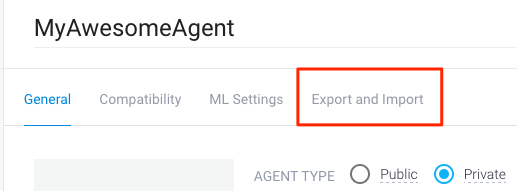
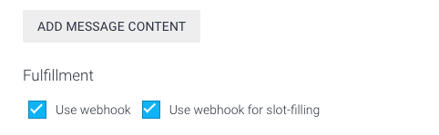

# Developing a Viber chatbot with DialogFlow (API.AI) and Node.js

In this example we are building a simple Viber chatbot using [DialogFlow](https://dialogflow.com/) and Node.js. The final chatbot will generate nutrition responses for users based on the inputs they provide. The bot uses the data.gov [nutrition facts API](https://ndb.nal.usda.gov/ndb/) as its source.

## Setup instructions

### Prerequisites
 1. [DialogFlow account](https://dialogflow.com)
 2. [Viber bot account](https://developers.viber.com)
 3. [Data.gov API key](https://api.data.gov/signup/)

See the developer guide at [developers.viber.com](https://developers.viber.com/docs/general/get-started/#get-started-with-bots/) for more details.

# Deploy to:

### Steps
 1. Create a new agent in [DialogFlow](https://dialogflow.com/).
 1. Click on the project gear icon () to see the project settings. 
 1. Select "Export and Import". 
 
	
	
 1. Select **"Restore from zip"**. Follow the directions to restore.
 1. Select the `ViberSampleAgent.zip` file in this repository.
 1. [Optional] Set your [Data.gov API key](https://api.data.gov/signup/) in the environment variable:
	 1. Copy the sample environment variable `cp .env.sample .env`. 
	 1. Edit `.env` with your Data.gov API key.
 1. Deploy this app to your preferred hosting environment.
 1. Set the **"Fulfillment"** webhook URL to the deployment url. For instance on Heroku it will look like this `https://[App Name].herokuapp.com/hook`.
 1. Enable Viber in the DialogFlow **"Integrations"** panel.
 1. For both `meal.info` and  `nutrition.info` **intents** check both "Use webhook" and "Use webhook for slot-filling" in the "Fulfillment" section, and save the intent. 

	

## References and how to report bugs
If you find any issues with this sample, please open a bug [here](../../issues/new) on GitHub.

## Terms
Your use of this sample is subject to, and by using or downloading the sample files you agree to comply with, the [Viber API Terms of Service](https://developers.viber.com/docs/general/api-terms-of-service/).
